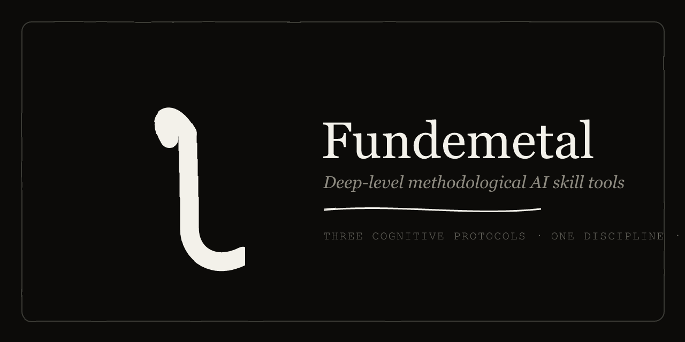

# γ Fundemetal

*Fundamental, by design — the metal underneath the fundamentals.*

**Deep-level, methodological AI skill tools.** We ship only one kind of AI skill: cognitive protocols that force AI (and humans) into the right thinking discipline. Not task tools — *methods*.

> Built for thinking itself.



## What it is

Fundemetal is a small, curated collection of **cognitive protocols** — plain Markdown skill files you drop into your agent (Claude, TRAE, Cursor, Windsurf). Each one attacks a specific failure mode in how we think, plan, and decompose problems. The output isn't a task done for you; it's a better-shaped problem and a sharper plan.

## The skills

| # | Skill | One line |
|---|---|---|
| 01 | **Decomposer** | Surface the unknown unknowns — turn *"I don't know what I don't know"* into actionable known unknowns. |
| 02 | **Tension Mining** | Find the force in the system — mine irreducible tensions → cross-domain invariants → mechanisms. |
| 03 | **Great Expectations** | Anti-consensus, anti-template planning with BANI + integrity gates. |
| 04 | **Insight Crystallizer** | A meta-protocol — recognize a reusable methodology as it emerges, force the tacit insight into words, crystallize it into a new skill. |
| 05 | **Shoulders of Giants** | Reuse existing code as a sovereignty decision — map the core domain, choose reuse depth, demand an escape plan for every dependency. |
| 06 | **Pre-Mortem** | Assume it failed; write the obituary with >=5 mechanisms, at least one self-inflicted. |
| 07 | **Outside View** | Before you argue you're the exception, check the base rate. Base rates before 'we're different'. |
| 08 | **Resulting** | A good result != a good decision. Judge the call, not the roll. |
| 09 | **Source Ledger** | Tag each load-bearing claim verified/inferred/reported/assumed; >40% assumed -> no conclusion. |
| 10 | **Disconfirmation Hunt** | Name what would prove you wrong, then go find it. Support isn't proof. |
| 11 | **Crux Finder** | Locate the one belief whose reversal flips the conclusion -- or prove it's values. |
| 12 | **Red Cell** | A standing red team that must concede hits before the plan ships. |
| 13 | **Silent Start** | Everyone writes independently first; kill the information cascade in panels. |
| 14 | **Question Autopsy** | A brilliant answer to the wrong question is worse than useless. |
| 15 | **Quantity Quota** | Generate 30 candidates before evaluating any. The first idea is a thief. |
| 16 | **Trade-off Ledger** | Every benefit must state what it costs. No free lunch -- only an unpaid bill. |
| 17 | **Second-Order** | The board reacts; model the reaction and the reaction to the reaction. |
| 18 | **Steelman Forge** | State their view so well they'd sign it -- then refute it. |
| 19 | **Stopping Rule** | The one protocol that tells you to close the library. More thinking != deciding. |
| 20 | **Sycophancy Breaker** | Tax agreement so a 'yes' means something; defeat the objection first. |
| 21 | **Goal Anchor** | By step 40 the agent optimizes a sub-goal; re-anchor to the verbatim original. |
| 22 | **Taboo** | Forbid the jargon; what's left is a real idea or an honest silence. |
| 23 | **Curator** | The bar every skill here had to pass. A library is defined by what it refuses. |

Each skill lives in [`skills/`](skills/).

## Shared DNA

Six hard constraints every skill obeys:

1. **Cognitive protocol, not a tool** — forces a thinking discipline, not a single action.
2. **Anti-cheat hard gates** — red flags, banned words, acceptance metrics that stop hollow output.
3. **Academic grounding** — Kahneman, Kuhn, Cynefin, BANI — standing on validated frameworks.
4. **Markdown-first** — every protocol is plain Markdown; plug into any agent, no build step. (Tension Mining optionally ships an academic paper + validation script as grounding, kept separate from the protocol.)
5. **Swiss B&W aesthetic** — minimal, high-contrast, fast, accessible.
6. **Open source (CC0)** — repository is CC0 1.0; individual skills keep their MIT license where noted. Fork it, cite it, remix it.

## Use a skill

Copy a skill folder (e.g. `skills/decomposer/`) into your agent's skills directory, or paste its `SKILL.md` into your system prompt. No build step — every protocol is plain Markdown.

```markdown
# In your agent, reference the protocol:
"Follow the Decomposer protocol in SKILL.md before proposing any plan."
```

## The sequence

**Decomposer → Tension Mining → Great Expectations.** Each is strong alone; run them in sequence and you get something no other tool can give you — honest unknowns, the underlying force, then a genuinely original plan.

Insight Crystallizer is a **meta-skill** — it *manufactures* new skills rather than running in the sequence. Invoke it whenever a reusable methodology surfaces in your work.

Shoulders of Giants covers a different moment entirely — choosing which existing code to stand on, handled as a sovereignty decision rather than a keyword search. It runs whenever a build-vs-borrow call is on the table.

## License

**Repository: CC0 1.0** (public-domain dedication).

Individual skills retain their own upstream license where noted — each skill folder carries a `LICENSE` file (MIT, © CeaserZhao). Use, fork, and remix freely.
